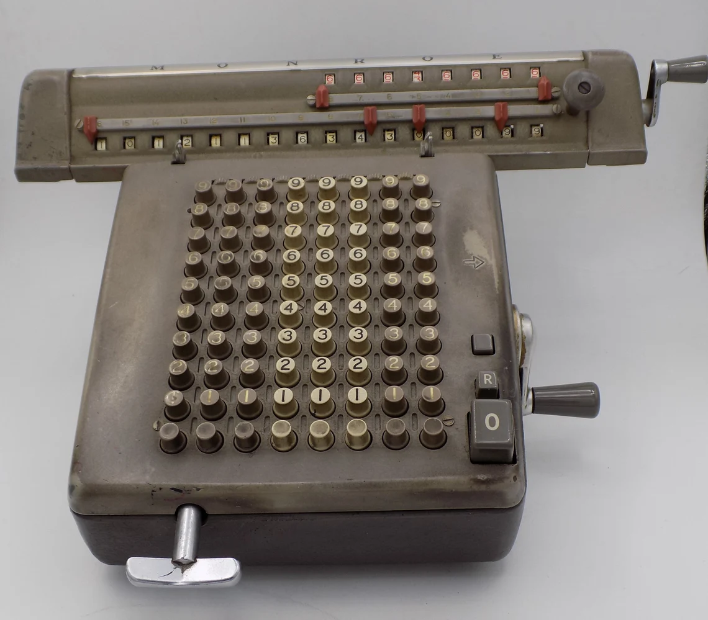

# **My Calculator**

## **Introduction**

This Python project, My Calculator, aims to create a simple calculator displayed in your
computer terminal. You can perform all the seven basic operations of the Python language :
addition, subtraction, multiplication, division, power, floor division and modulo.
In his menu you can choose to use the result of the last operation in your calculation
or to start a new one with two new numbers. You can also display the operations history
which have been saved in a json file.

- Language used: Python
- Library used: json

## **Installation**

To install My Calculator, follow these steps:

1. Clone this repository: **`git clone https://github.com/olivier-portal/my-calculator`**
2. Download the Python language: **https://www.python.org/downloads/**
3. Navigate to the project directory: **`cd my-calculator`**

## **Usage**

To use My Calculator, follow these steps:

1. Open the computer terminal.
2. Navigate to the project directory: **`cd my-calculator`**
3. Launch the main.py file: **`py main.py`** or **`python main.py`** or **`python3 main.py`**
4. Play the game.

## **Authors and Acknowledgment**

My Calculator was created by :

- **[Thibault CARON](https://github.com/thibault-caron)**
- **[Lorenzo OTTAVIANI](https://github.com/lorenzo-ottaviani)**
- **[Olivier PORTAL](https://github.com/olivier-portal)**

Thank you to all the contributors for their hard work and dedication to the project.
